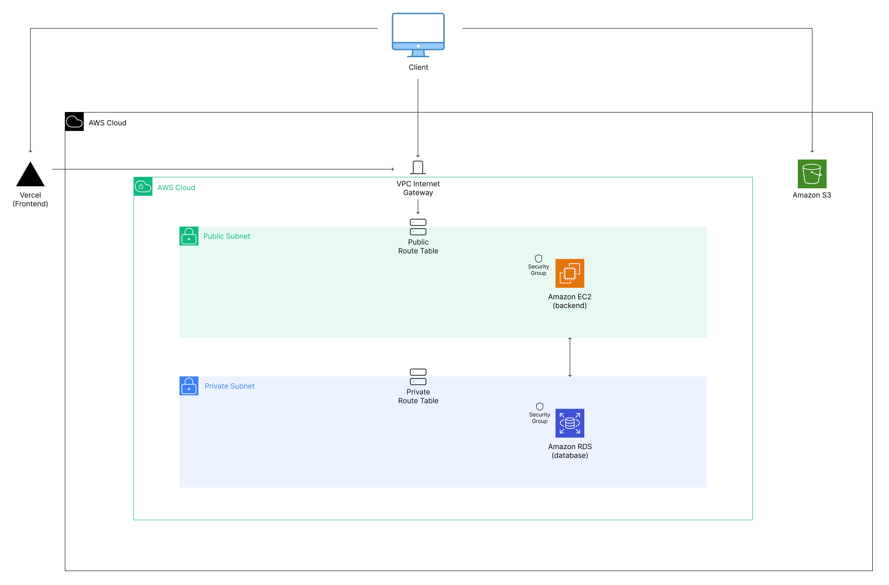

  <h1 align="center">Devbook</h1>

  <h3 align="center">Social Media for Developers</h3>

## 📋 <a name="table">Table of Contents</a>

1. 🤖 [Introduction](#introduction)
2. ⚙️ [Tech Stack](#tech-stack)
3. 🔋 [Features](#features)
4. 💻 [Network Architecture](#network-architecture)
5. 🔗 [Links](#links)

## <a name="introduction">🤖 Introduction</a>

A social media backend built with Node.js 22+ and hosted on Amazon AWS. Create and manage your account, update your profile, make friends, and share posts with other users.

## <a name="tech-stack">⚙️ Tech Stack</a>

- Node.js
- Express
- TypeScript
- Prisma ORM
- PostgreSQL databases
- JSON Webtoken Authentication
- Zod Input Validation
- Nodemailer
- Multer + Sharp
- AWS Services: VPC, EC2, RDS, API Gateway, S3

## <a name="features">🔋 Features</a>

👉 **Security**: Security features such as CORS, rate limiting, and HTTP parameter filtering, help keep the app secure.

👉 **Extensive Error Handling**: Global error handling middleware provides meaningful error messaging for a wide variety of errors, both within the repo and from external packages such as Prisma and Zod.

👉 **Scalable Route Handling**: Scalable architecture to easily add more logic in controllers and api routes.

👉 **CRUD Factory**: Reusable crud logic to easily apply to different routes throughout the repository. Easily create, update, read unique, read all, or delete records in PostgreSQL database.

👉 **JWT Authentication**: Private routes only available to users with valid JWT in the request.

👉 **Route Permissions**: Restrictions on user roles prevent users without proper role identifiers access to specific routes.

👉 **Fully Typed**: Exhaustively typed with separate npm package for consistency between frontend and backend.

👉 **Data Validation with Zod**: Data integrity with data validation using Zod with separate npm package for consistency between frontend and backend.

👉 **Prisma ORM Extensions**: Extensions to Prisma client allow middleware for ORM requests. Used to hide sensitive data such as passwords for user requests.

👉 **Image Handling with Multer, Sharp, S3**: Multer and Sharp used to upload and modify images before uploading to S3.

👉 **AWS Hosting**: AWS architecture finds finds API hosted with EC2 on public subnet which communicates with PostgreSQL database hosted with RDS on private subnet.

## <a name="network-architecture">💻 Network Architecture</a>

  

- Devbook backend and database hosted on Amazon VPC.
- VPC has two subnets: public and private.
- Private subnets have only local routes, so cannot communicate with any requests outside of cloud.
- Public subnet has internet gateway route, giving the cloud a public access point.
- Backend hosted with EC2. Located in public subnet.
- Database hosted with RDS. Located in private subnet.
- Each has security group rules allowing certain requests.
- Next.js frontend hosted on Vercel communicates with internet gateway to gain access to cloud data.
- User images stored on S3, viewed in frontend.

## <a name="links">🔗 Links</a>

- [Devbook Home](https://devbook-next.vercel.app/): Devbook login page
- [linkedin](https://www.linkedin.com/in/vkastanenka/): View Victoria's professional profile.
- [devbook-next](https://github.com/vkastanenka/devbook-node): Frontend repository built with Next.js 14+.
- [devbook-prisma](https://github.com/vkastanenka/devbook-prisma): Prisma ORM utilized by both frontend and backend.
- [devbook-types](https://github.com/vkastanenka/devbook-types): Typescript types used throughout both frontend, backend, and validation.
- [devbook-validation](https://github.com/vkastanenka/devbook-validation): Zod validation schemas used throughout both frontend and backend.